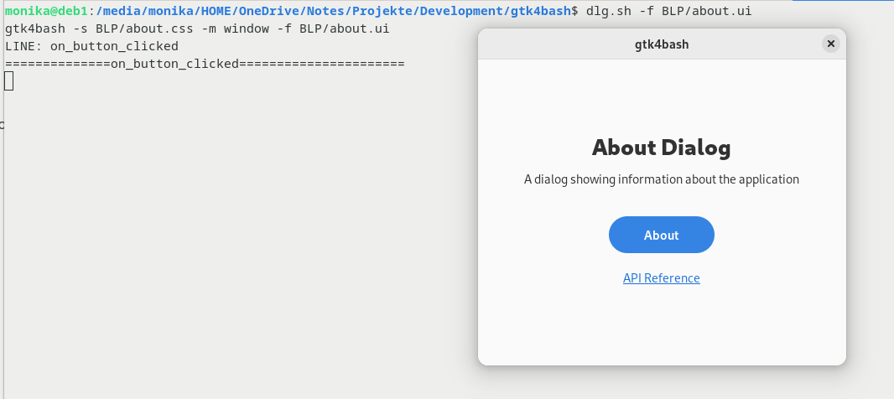

# gtk4bash - Steuerung eines gtk4 Fenster mit der Bash

My English is not as good as any automatic translation, e.g. [Google translate](https://translate.google.com/?hl=de&sl=de&tl=en&op=translate).

[gtkwrap](https://github.com/abecadel/gtkwrap) für GTK4 angepasst.

[Beschreibung](help/help.md)

