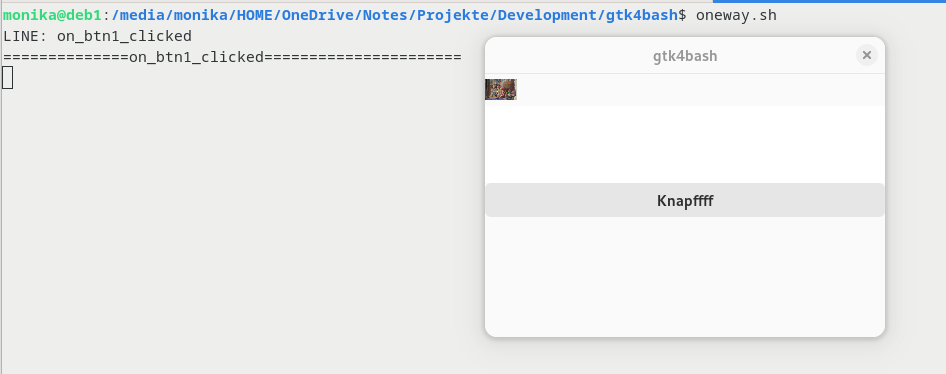
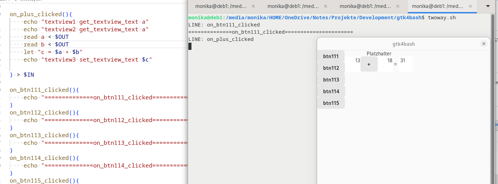
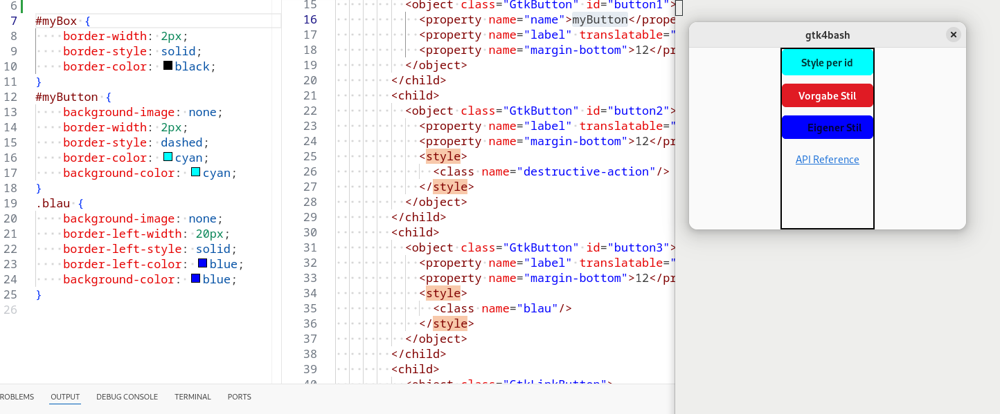
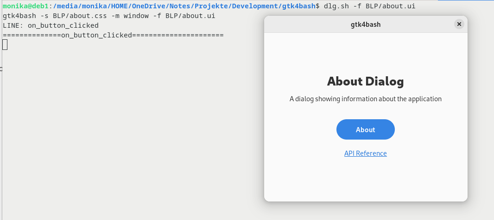

# Steuerung eines GTK4 Fenster mit der Bash
My English is not as good as any automatic translation, e.g. [Google translate](https://translate.google.com/?hl=de&sl=de&tl=en&op=translate).

Gtk4bash ist ein Tool um einen GTK4 Dialog mit Bash zu steuern. Das Projekt [gtkwrap](https://github.com/abecadel/gtkwrap) funktioniert nur mit GTK2 und GTK3. Dessen Quellen wurden für GTK4 angepasst. 

# 1.1 Credits
# 1.1.1 gtkwrap
Die Kopplung zwischen Signalen und Bash, die [gtkwrap](https://github.com/abecadel/gtkwrap) für GTK2 und GTK3 erstellt verwende ich nahezu unverändert.
# 1.1.2 Blueprint Compiler
Der [Blueprint Compiler](https://gitlab.gnome.org/GNOME/blueprint-compiler) erleichtert das Erstellen von Oberflächen sehr. Er ist zum Verwenden der Dialoge im BLP Verzeichnis nötig. 
# 1.1.3 Expat
Zum Parsen der UI Datei verwende ich [expat](https://github.com/libexpat/libexpat.github.io).
# 1.1.4 GTK4 Workbench
[Workbench](https://github.com/workbenchdev/Workbench) ist sehr hilfreich um sich in GTK4 hineinzuarbeiten. Für die Verwendung von gtk4wrap ist es nicht nötig.
# 1.1.5 LibAdwaita
[LibAdwaite](https://gnome.pages.gitlab.gnome.org/libadwaita/doc/main/index.html) ist für Dialoge im Verzeichnis BLP nötig.
# 2. Installation
Das Projekt besteht im wesentlichen aus einer C Datei und einem Makefile. Die GTK4 Entwicklungsbibliotheken müssen installiert sein. Dann erzeugt make eine ausführbare Datei. 

# 3. Verwendung
Die mit make erzeugte ausführbare Datei gtk4bash kann mit den Scripten getestet werden. 
# 3.1 Proof of Concept
# 3.1.1 Oneway
oneway.sh

# 3.1.2 Twoway
twoway.sh

# 3.1.3 Loadstyle
loadstyle.sh

# 3.2 Systematisch Adwaita
Mit dem Script dlg.sh können die Dialoge in BPR getestet werden.
dlg.sh -f BLP/about.ui
